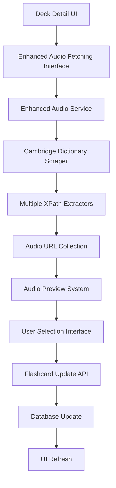

# Design Document

## Overview

The Enhanced Audio Fetching feature extends the existing audio service to provide comprehensive audio pronunciation selection capabilities. The system will build upon the current `CambridgeAudioFetcher` class and deck detail interface to offer users multiple pronunciation options with preview and selection functionality.

The design maintains compatibility with the existing audio fetching infrastructure while introducing new components for multi-source extraction, audio preview, and user selection interfaces. The feature integrates seamlessly into the current deck detail carousel interface without disrupting existing functionality.

## Architecture

### High-Level Architecture



### Component Interaction Flow

1. **User Initiation**: User clicks enhanced audio fetch button on any flashcard
2. **Service Invocation**: Enhanced audio service fetches multiple audio sources
3. **Data Processing**: System extracts and validates multiple audio URLs
4. **UI Presentation**: Modal interface displays audio options with preview capability
5. **User Selection**: User previews and selects preferred audio pronunciation
6. **Data Persistence**: Selected audio URL updates the flashcard record
7. **Interface Update**: Deck detail view refreshes with new audio information

## Components and Interfaces

### 1. Enhanced Audio Service (`EnhancedCambridgeAudioFetcher`)

**Purpose**: Extends existing audio fetching to support multiple audio sources and enhanced extraction.

**Key Methods**:
```python
class EnhancedCambridgeAudioFetcher(CambridgeAudioFetcher):
    def fetch_multiple_audio_sources(self, word: str) -> List[AudioOption]
    def extract_audio_from_multiple_selectors(self, tree) -> List[Dict]
    def validate_audio_urls(self, audio_urls: List[str]) -> List[AudioOption]
    def get_pronunciation_labels(self, audio_element) -> str
```

**Audio Option Data Structure**:
```python
@dataclass
class AudioOption:
    url: str
    label: str  # e.g., "US pronunciation", "UK pronunciation"
    selector_source: str  # e.g., "audio1", "audio2"
    is_valid: bool
    error_message: Optional[str]
```

**XPath Selectors Configuration**:
```python
AUDIO_SELECTORS = [
    {
        'id': 'audio1',
        'xpath': '//*[@id="audio1"]/source[1]',
        'label_xpath': '//*[@id="audio1"]/../span[@class="region"]',
        'default_label': 'Primary pronunciation'
    },
    {
        'id': 'audio2', 
        'xpath': '//*[@id="audio2"]/source[1]',
        'label_xpath': '//*[@id="audio2"]/../span[@class="region"]',
        'default_label': 'Alternative pronunciation'
    }
]
```

### 2. Audio Selection Modal Interface

**Purpose**: Provides interactive interface for audio preview and selection.

**HTML Structure**:
```html
<div id="audio-selection-modal" class="modal">
    <div class="modal-content">
        <div class="modal-header">
            <h3>Select Audio Pronunciation for: <span class="word-display"></span></h3>
            <button class="close-modal">&times;</button>
        </div>
        <div class="modal-body">
            <div class="audio-options-container">
                <!-- Dynamic audio options will be inserted here -->
            </div>
            <div class="current-audio-section">
                <!-- Shows existing audio if available -->
            </div>
        </div>
        <div class="modal-footer">
            <button class="btn-cancel">Cancel</button>
            <button class="btn-keep-current">Keep Current</button>
            <button class="btn-confirm-selection">Confirm Selection</button>
        </div>
    </div>
</div>
```

**Audio Option Component**:
```html
<div class="audio-option" data-audio-url="{url}">
    <div class="audio-option-header">
        <input type="radio" name="audio-selection" value="{url}" id="audio-{index}">
        <label for="audio-{index}" class="audio-label">{label}</label>
    </div>
    <div class="audio-controls">
        <button class="btn-preview" data-audio-url="{url}">
            <i class="fas fa-play"></i> Preview
        </button>
        <div class="audio-status">
            <span class="status-indicator"></span>
            <span class="status-text"></span>
        </div>
    </div>
</div>
```

### 3. Enhanced Audio Fetching API

**Purpose**: Provides backend endpoint for fetching multiple audio sources.

**Endpoint**: `POST /api/fetch-enhanced-audio/`

**Request Format**:
```json
{
    "card_id": 123,
    "word": "example"
}
```

**Response Format**:
```json
{
    "success": true,
    "word": "example",
    "current_audio": "https://current-audio-url.mp3",
    "audio_options": [
        {
            "url": "https://audio1-url.mp3",
            "label": "US pronunciation",
            "selector_source": "audio1",
            "is_valid": true
        },
        {
            "url": "https://audio2-url.mp3", 
            "label": "UK pronunciation",
            "selector_source": "audio2",
            "is_valid": true
        }
    ],
    "total_found": 2
}
```

### 4. Audio Selection JavaScript Module

**Purpose**: Manages client-side audio preview, selection, and modal interactions.

**Key Functions**:
```javascript
class EnhancedAudioManager {
    showAudioSelectionModal(cardId, word)
    fetchAudioOptions(cardId, word)
    renderAudioOptions(audioOptions)
    previewAudio(audioUrl)
    handleAudioSelection(selectedUrl)
    updateFlashcardAudio(cardId, audioUrl)
    closeModal()
}
```

### 5. Integration with Existing Deck Detail Interface

**Purpose**: Seamlessly integrates enhanced audio fetching into current carousel interface.

**Integration Points**:
- Enhanced audio fetch button added to each flashcard view mode
- Modal overlay system that doesn't interfere with carousel navigation
- Audio status updates that refresh the existing audio statistics
- Compatibility with existing edit mode functionality

## Data Models

### No Database Schema Changes Required

The enhanced audio fetching feature utilizes the existing `Flashcard.audio_url` field and doesn't require any database schema modifications. The system works by:

1. Fetching multiple audio options from external sources
2. Presenting options to the user for selection
3. Updating the existing `audio_url` field with the selected option
4. Maintaining backward compatibility with existing audio functionality

### Temporary Data Structures

**Audio Selection Session Data**:
```python
# Stored in user session during selection process
audio_selection_session = {
    'card_id': int,
    'word': str,
    'current_audio': str,
    'fetched_options': List[AudioOption],
    'timestamp': datetime,
    'expires_at': datetime
}
```

## Error Handling

### Network and External Service Errors

**Cambridge Dictionary Unavailable**:
- Graceful degradation with clear user messaging
- Retry mechanism with exponential backoff
- Fallback to existing audio fetching if enhanced fetching fails

**Audio URL Validation Errors**:
- Client-side validation of audio URLs before presentation
- Server-side validation during audio option fetching
- Clear error indicators for invalid or inaccessible audio files

**Rate Limiting Protection**:
- Respect existing rate limiting in `CambridgeAudioFetcher`
- Additional delays between multiple XPath extractions
- User feedback during rate limit delays

### User Interface Error Handling

**Modal Interface Errors**:
- Loading state management during audio fetching
- Error states for failed audio preview attempts
- Graceful modal closure on critical errors

**Audio Playback Errors**:
- Individual audio option error states
- Fallback messaging for unsupported audio formats
- Browser compatibility error handling

## Testing Strategy

### Unit Testing

**Enhanced Audio Service Tests**:
```python
class TestEnhancedCambridgeAudioFetcher:
    def test_fetch_multiple_audio_sources_success()
    def test_fetch_multiple_audio_sources_partial_failure()
    def test_extract_audio_from_multiple_selectors()
    def test_validate_audio_urls()
    def test_get_pronunciation_labels()
```

**API Endpoint Tests**:
```python
class TestEnhancedAudioAPI:
    def test_fetch_enhanced_audio_success()
    def test_fetch_enhanced_audio_no_options_found()
    def test_fetch_enhanced_audio_invalid_card()
    def test_fetch_enhanced_audio_network_error()
```

### Integration Testing

**End-to-End Audio Selection Flow**:
1. User clicks enhanced audio fetch button
2. System fetches multiple audio options
3. Modal displays with preview functionality
4. User selects preferred audio option
5. Flashcard updates with selected audio
6. Interface refreshes with new audio information

**Browser Compatibility Testing**:
- Audio playback across different browsers
- Modal interface responsiveness on mobile devices
- Touch interaction testing for mobile users

### Performance Testing

**Audio Fetching Performance**:
- Multiple XPath extraction timing
- Concurrent audio URL validation
- Modal rendering performance with multiple options

**Rate Limiting Compliance**:
- Verify respectful interaction with Cambridge Dictionary
- Test rate limiting under concurrent user scenarios
- Validate timeout and retry mechanisms

## Security Considerations

### Input Validation

**Word Parameter Sanitization**:
- Validate word input to prevent XSS attacks
- Sanitize word parameter before URL construction
- Limit word length and character set

**Audio URL Validation**:
- Validate audio URLs before storage
- Prevent malicious URL injection
- Ensure URLs point to legitimate audio resources

### External Service Interaction

**Cambridge Dictionary Scraping**:
- Respect robots.txt and terms of service
- Implement proper User-Agent headers
- Maintain rate limiting to avoid service abuse

**Audio Resource Validation**:
- Validate audio file headers before presentation
- Prevent serving malicious audio content
- Implement content-type validation

## Performance Optimization

### Caching Strategy

**Audio Option Caching**:
- Cache fetched audio options for short periods (5-10 minutes)
- Reduce redundant Cambridge Dictionary requests
- Clear cache on user selection to prevent stale data

**Client-Side Optimization**:
- Lazy loading of audio preview functionality
- Efficient modal rendering and cleanup
- Optimized audio playback management

### Resource Management

**Memory Management**:
- Proper cleanup of audio objects after preview
- Efficient modal DOM manipulation
- Garbage collection of temporary audio elements

**Network Optimization**:
- Batch audio URL validation requests
- Implement request deduplication
- Optimize XPath extraction efficiency